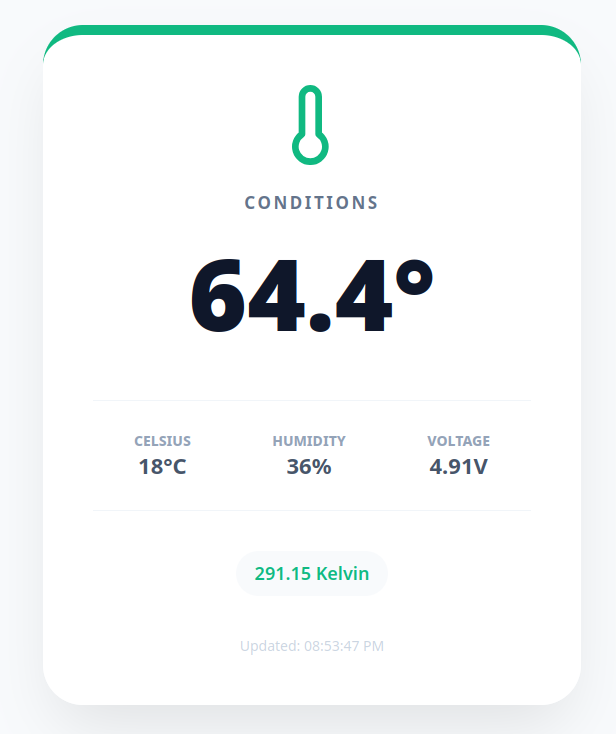

# 🌡️ PicoTempSensor

A lightweight, robust environment monitoring suite designed for the Raspberry Pi Pico W and Linux. It features a dynamic, color-shifting dashboard that changes icons and themes based on live temperature data.



## 🚀 Key Features

- **Adaptive UI**: Icons swap between Snowflake (Cold), Thermometer (Ideal), and Sun (Hot) with synced color themes.
- **Dual-Mode Compatibility**: The same UI logic runs on the Pico W (standalone) and the Linux Server (Receiver).
- **Production Ready**: Deployment on Linux using Podman Quadlets for native systemd integration.
- **Optimized Build**: Uses `uv` for lightning-fast Python dependency management inside a rootless container.

## 💻 Server Installation (Linx -> Podman)

The server runs as a rootless Podman container managed by a systemd Quadlet.

### 1. Clone the Repository

```bash
git clone https://github.com/SEary342/PicoTempSensor.git
cd PicoTempSensor
```

### 2. Run the Installer

You can specify a custom port as an argument (defaults to 5000).

```bash
./install.sh 8080
```

### 3. Manage the Service

```bash
# View live logs
journalctl --user -u PicoTempSensor -f

# Check status
systemctl --user status PicoTempSensor
```

## 📟 Pico W Setup

### 1. Configure Environment

Create a `pico/.env` file based on your network settings:

```ini
WIFI_SSID="Your_SSID"
WIFI_PASS="Your_Password"
MODE="PUSH" # SERVER if you want to skip the flask install
REPORT_URL="http://<fedora-ip>:8080/data"
SENSOR_PIN=16
SLEEP_MINS=30
```

### 2. Flash Device

Upload all files inside the `/pico` directory to the root of your Raspberry Pi Pico W using Thonny or VS Code (Pico-W-Go).

## 🎨 UI Logic

The dashboard is driven by shared_html.py. It calculates the visual state based on the temperature in Fahrenheit:

- **Cold (< 60°F)**: Blue theme with Snowflake icon.
- **Ideal (60°F - 85°F)**: Green theme with Thermometer icon.
- **Hot (> 85°F)**: Red theme with Sun icon.

## 🧹 Uninstallation

To completely remove the container, service, and firewall rules:

```bash
chmod +x uninstall.sh
./uninstall.sh
```

## 🛠️ Tech Stack

- **Hardware**: Raspberry Pi Pico W + DHT11/DHT22 Sensor.
- **Server**: Fedora 43, Podman, Quadlets, Gunicorn.
- **Language**: MicroPython (Device) & Python 3.12 (Server).
- **Tooling**: `uv` for dependency management.

## 👨‍💻 Development

To run the server locally for development without Podman:

1. **Install Dependencies**:
   ```bash
   pip install flask
   ```

2. **Run Flask App**:
   ```bash
   python3 app.py
   ```

## 🛠️ Troubleshooting

### 1. Serial Port Access (VS Code / Thonny)

If you cannot connect to your Pico W or see "Permission Denied" when trying to flash the device, your Linux user likely lacks permission to access the USB serial port.

**The Fix**: Add your user to the dialout group:

```bash
sudo usermod -aG dialout $USER
```

> **Note**: You must log out and back in (or restart) for this change to take effect.

### 2. SELinux & Container Permissions

Fedora is "Secure by Default." If your server is running but you see 403 Forbidden or "Permission Denied" in the container logs, SELinux might be blocking access to the files in the pico/ folder.

**The Fix**: Relabel your project directory to allow container access:

```bash
sudo chcon -Rt svirt_sandbox_file_t /path/to/PicoTempSensor
```

### 3. Pico W Connection Issues

- **"No Route to Host"**: Ensure the `REPORT_URL` in your `.env` matches the Fedora server's IP. On Fedora, you can find your IP with `hostname -I`.
- **Port Blocked**: If the Pico logs show a timeout, verify the firewall is open on the server:

```bash
sudo firewall-cmd --list-ports
```

### 4. Persistence (Server mode)

If the PicoTempSensor service stops as soon as you close your SSH session:

**The Fix**: Ensure "linger" is enabled for your user account:

```bash
sudo loginctl enable-linger $(whoami)
```

### 5. Viewing Container Logs

If the dashboard isn't loading, check the internal Flask logs via the systemd journal:

```bash
journalctl --user -u PicoTempSensor -f
```
